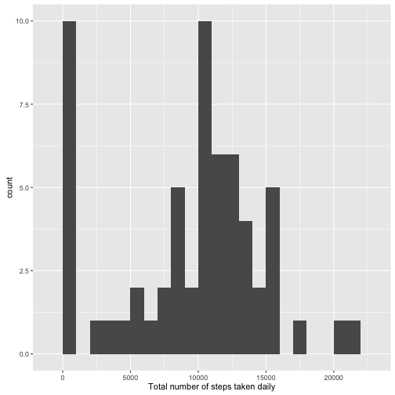
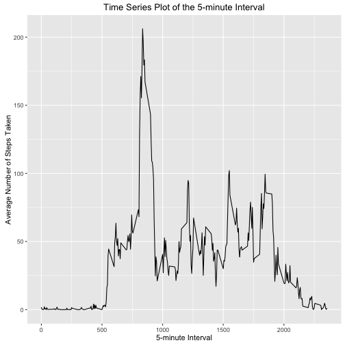
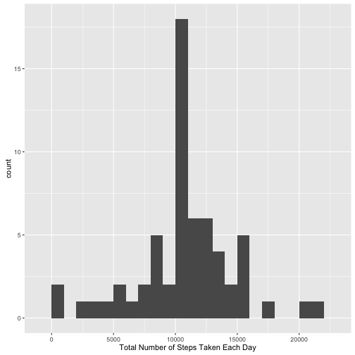
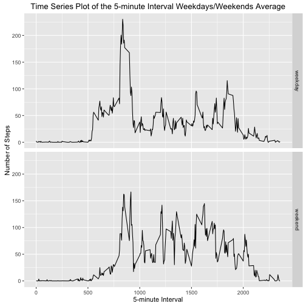

# Reproducible Research: Peer Assessment 1

### Settings


```r
echo = TRUE # Enables others to read the code
```

### Loading and preprocessing the data


```r
data <- read.csv("activity.csv")
```

### What is the mean total number of steps taken today?

For this part of the assignment, the missing values in the dataset can be ignored.  
It is required to:

1. Calculate the number of steps taken per day

2. Make a histogram of the total number of steps taken per day

3. Calculate and report the mean and median of the total number of steps taken per day


```r
library(ggplot2)
totalSteps <- tapply(data$steps, data$date, FUN = sum, na.rm = TRUE)
qplot(totalSteps, binwidth = 1000, xlab = "Total number of steps taken daily")
```



```r
mean(totalSteps, na.rm = TRUE)
```

```
## [1] 9354.23
```

```r
median(totalSteps, na.rm = TRUE)
```

```
## [1] 10395
```

### What is the average daily activity pattern?

A time series plot is required outlining the 5-minute interval (x-axis) and the average number of steps taken, averaged across all days (y-axis).


```r
averageSteps <- aggregate(x = list(steps = data$steps), by = list(interval = data$interval), FUN = mean, na.rm = TRUE)
ggplot(data = averageSteps, aes(x = interval, y = steps)) + geom_line() + ggtitle("Time Series Plot of the 5-minute Interval") + xlab("5-minute Interval") + ylab("Average Number of Steps Taken")
```



It is required to find out which 5-minute interval across all the days in the dataset contains the maximum number of steps.


```r
averageSteps[which.max(averageSteps$steps), ]
```

```
##     interval    steps
## 104      835 206.1698
```

### Imputing missing values

Given that the presence of missing days may introduce bias into some calculations or summaries of the data, it must be noted that there are a number of days/intervals where there are missing values (coded as NA).

It is required to:

1. Calculate and report the total number of missing values in the dataset (i.e. the total number of rows with NAs)

2. Devise a strategy for filling in all of the missing values in the dataset

3. Create a new dataset that is equal to the original dataset but with the missing data filled in

4. Make a histogram of the total number of steps taken each day and calculate and report the **mean** and **median** total number of steps taken per day


```r
missingValues <- is.na(data$steps)
table(missingValues)
```

```
## missingValues
## FALSE  TRUE 
## 15264  2304
```

```r
fillValue <- function(steps, interval) {
        filled <- NA
        if(!is.na(steps))
                filled <- c(steps)
        else
                filled <- (averageSteps[averageSteps$interval == interval, "steps"])
        return(filled)
}
filledData <- data
filledData$steps <- mapply(fillValue, filledData$steps, filledData$interval)
totalSteps <- tapply(filledData$steps, filledData$date, FUN = sum)
qplot(totalSteps, binwidth = 1000, xlab = "Total Number of Steps Taken Each Day")
```



```r
mean(totalSteps)
```

```
## [1] 10766.19
```

```r
median(totalSteps)
```

```
## [1] 10766.19
```

### Are there any differences in activity patterns between weekdays and weekends?

It is required to:

1. Create a new factor variable in the dataset with two levels - "weekday" and "weekend" indicating whether a given date is a weekday or weekend day

2. Make a panel plot containing a time series plot of the 5-minute interval (x-axis) and the average number of steps taken, averaged across all weekday days or weekend days (y-axis)


```r
weekdayOrWeekend <- function(date) {
        day <- weekdays(date)
        if (day %in% c("Monday", "Tuesday", "Wednesday", "Thursday", "Friday"))
                return("weekday")
        else if (day %in% c("Saturday", "Sunday"))
                return("weekend")
        else
                stop("invalid date")
}
filledData$date <- as.Date(filledData$date)
filledData$day <- sapply(filledData$date, FUN = weekdayOrWeekend)
averageSteps <- aggregate(steps ~ interval + day, data = filledData, mean)
ggplot(averageSteps, aes(interval, steps)) + geom_line() + facet_grid(day ~ .) +
        ggtitle("Time Series Plot of the 5-minute Interval Weekdays/Weekends Average") +
        xlab("5-minute Interval") + ylab("Number of Steps")
```


